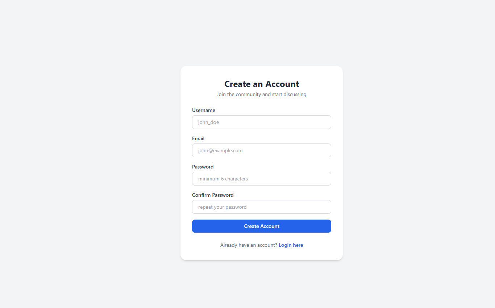
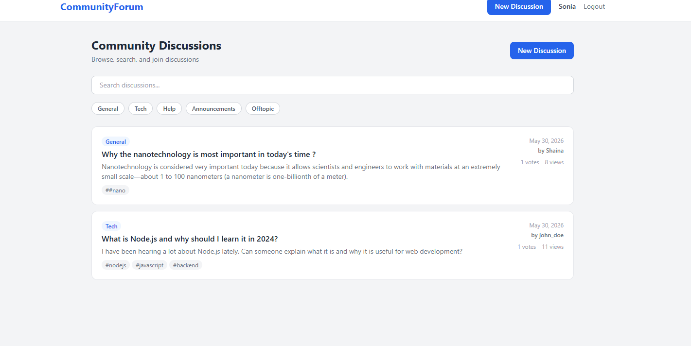
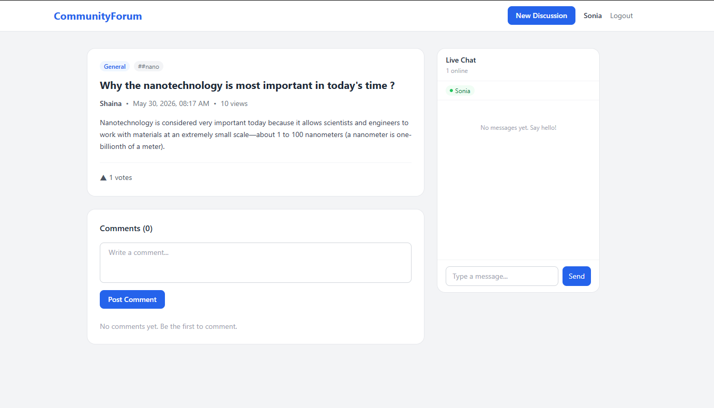
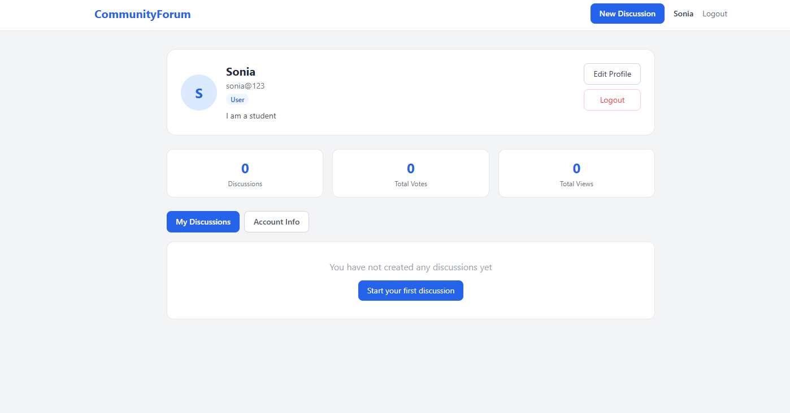

# Community Discussion Forum with Real Time Chat

A full stack community platform where users can register, create discussions, post comments, reply to comments, vote on content, and communicate through real time chat inside each discussion room.

---

## Live Features

- User registration and login with JWT authentication
- Create, read, update, and delete discussions
- Category filters and search across all discussions
- Threaded comments with replies
- Vote on discussions and comments
- Real time chat inside every discussion room
- Online users indicator and typing indicator in chat
- User profile page with stats and edit functionality
- Protected routes and role based access

---

## Tech Stack

| Layer | Technology |
|---|---|
| Frontend | React.js, Vite, Tailwind CSS |
| Backend | Node.js, Express.js |
| Database | MongoDB, Mongoose |
| Authentication | JWT, bcryptjs |
| Real Time | Socket.IO |
| HTTP Client | Axios |
| Notifications | React Hot Toast |

---

## Project Structure

## Project Structure

\`\`\`
community-discussion-forum/
│
├── 📁 client/                        ← React frontend
│   ├── 📁 public/
│   │   └── vite.svg
│   ├── 📁 src/
│   │   ├── 📁 components/
│   │   │   ├── 📁 layout/
│   │   │   │   └── Navbar.jsx       ← Top navigation bar
│   │   │   └── 📁 ui/
│   │   │       ├── Spinner.jsx      ← Reusable loading spinner
│   │   │       └── Badge.jsx        ← Reusable badge component
│   │   ├── 📁 context/
│   │   │   └── AuthContext.jsx      ← Global auth state
│   │   ├── 📁 pages/
│   │   │   ├── Register.jsx         ← User registration page
│   │   │   ├── Login.jsx            ← User login page
│   │   │   ├── Dashboard.jsx        ← All discussions feed
│   │   │   ├── CreateDiscussion.jsx ← Create new discussion
│   │   │   ├── DiscussionDetail.jsx ← Discussion + comments + chat
│   │   │   └── Profile.jsx          ← User profile page
│   │   ├── 📁 services/
│   │   │   ├── api.js               ← Axios instance with token
│   │   │   └── socket.js            ← Socket.IO client setup
│   │   ├── App.jsx                  ← Routes and protected routes
│   │   ├── main.jsx                 ← React entry point
│   │   └── index.css                ← Tailwind CSS imports
│   ├── tailwind.config.js
│   ├── vite.config.js               ← Vite proxy to backend
│   └── package.json
│
├── 📁 server/                        ← Node.js backend
│   ├── 📁 config/
│   │   └── db.js                    ← MongoDB connection
│   ├── 📁 controllers/
│   │   ├── authController.js        ← Register, login, profile
│   │   ├── discussionController.js  ← Discussion CRUD and votes
│   │   └── commentController.js     ← Comment CRUD and votes
│   ├── 📁 middleware/
│   │   └── authMiddleware.js        ← JWT token verification
│   ├── 📁 models/
│   │   ├── User.js                  ← User schema
│   │   ├── Discussion.js            ← Discussion schema
│   │   ├── Comment.js               ← Comment schema
│   │   └── Message.js               ← Chat message schema
│   ├── 📁 routes/
│   │   ├── authRoutes.js            ← Auth API routes
│   │   ├── discussionRoutes.js      ← Discussion API routes
│   │   ├── commentRoutes.js         ← Comment API routes
│   │   └── messageRoutes.js         ← Message API routes
│   ├── 📁 sockets/
│   │   └── chatSocket.js            ← Socket.IO event handlers
│   ├── 📁 docs/
│   │   └── 📁 screenshots/          ← Project screenshots
│   ├── index.js                     ← Express server entry point
│   ├── .env.example                 ← Environment variable template
│   └── package.json
│
├── README.md                         ← Project documentation
└── .gitignore                        ← Ignored files
\`\`\`

### Auth
| Method | Endpoint | Access | Description |
|---|---|---|---|
| POST | /api/auth/register | Public | Register new user |
| POST | /api/auth/login | Public | Login user |
| GET | /api/auth/me | Private | Get current user |
| PUT | /api/auth/profile | Private | Update profile |

### Discussions
| Method | Endpoint | Access | Description |
|---|---|---|---|
| GET | /api/discussions | Public | Get all discussions |
| GET | /api/discussions/:id | Public | Get single discussion |
| POST | /api/discussions | Private | Create discussion |
| PUT | /api/discussions/:id | Private | Update discussion |
| DELETE | /api/discussions/:id | Private | Delete discussion |
| POST | /api/discussions/:id/vote | Private | Vote on discussion |

### Comments
| Method | Endpoint | Access | Description |
|---|---|---|---|
| GET | /api/comments/:discussionId | Public | Get comments |
| POST | /api/comments | Private | Post comment |
| PUT | /api/comments/:id | Private | Update comment |
| DELETE | /api/comments/:id | Private | Delete comment |
| POST | /api/comments/:id/vote | Private | Vote on comment |

### Messages
| Method | Endpoint | Access | Description |
|---|---|---|---|
| GET | /api/messages/:roomId | Private | Get chat history |
| DELETE | /api/messages/:id | Private | Delete message |

---

## Socket.IO Events

### Client emits
| Event | Description |
|---|---|
| joinRoom | Join a discussion chat room |
| sendMessage | Send a chat message |
| typing | Notify others user is typing |
| stopTyping | Notify others user stopped typing |
| leaveRoom | Leave a chat room |

### Server emits
| Event | Description |
|---|---|
| previousMessages | Chat history on join |
| newMessage | New incoming message |
| onlineUsers | Updated online users list |
| userTyping | Someone is typing |
| userStopTyping | Someone stopped typing |
| userJoined | User joined notification |
| userLeft | User left notification |

---

## How to Run Locally

### Prerequisites
- Node.js v18 or higher
- MongoDB installed locally or a MongoDB Atlas account
- Git

### Backend Setup

\`\`\`bash
cd server
npm install
\`\`\`

Create a `.env` file inside the server folder:

\`\`\`
PORT=5000
MONGO_URI=your_mongodb_connection_string
JWT_SECRET=your_jwt_secret_key
\`\`\`

Start the backend:

\`\`\`bash
npm run dev
\`\`\`

### Frontend Setup

\`\`\`bash
cd client
npm install
npm run dev
\`\`\`

Open your browser and go to:
\`\`\`
http://localhost:5173
\`\`\`

---
## Demo Video

Click the image above to watch the full demo

## Screenshots

### Register Page

### Dashboard

### Discussion Detail with Chat

### Profile Page

---

## What I Learned

- Building a REST API with Node.js and Express
- Designing MongoDB schemas with Mongoose and handling relationships
- JWT based authentication and protected routes
- Real time bidirectional communication using Socket.IO
- Managing global state in React using Context API
- Building responsive UI with Tailwind CSS
- Connecting frontend and backend with Axios and proxy configuration
- Handling socket rooms, typing indicators, and online presence

---

## Author
Sonia Thakur
GitHub: https://github.com/Sonia068
LinkedIn: https://www.linkedin.com/in/sonia-thakur-6ab93b349/

Built as a full stack development course project to demonstrate skills in React, Node.js, MongoDB, and Socket.IO.
